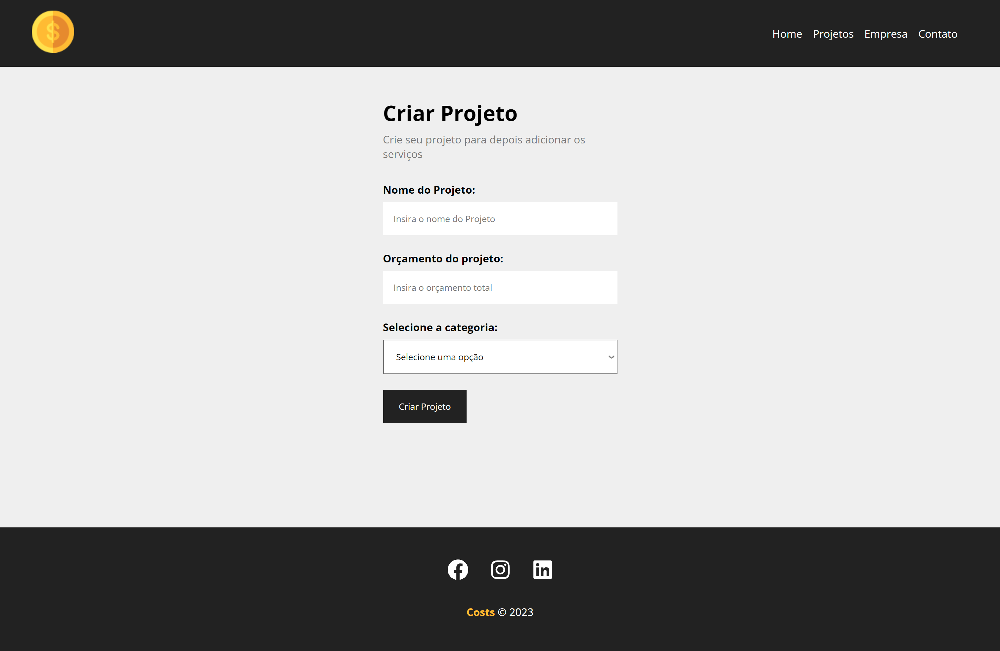
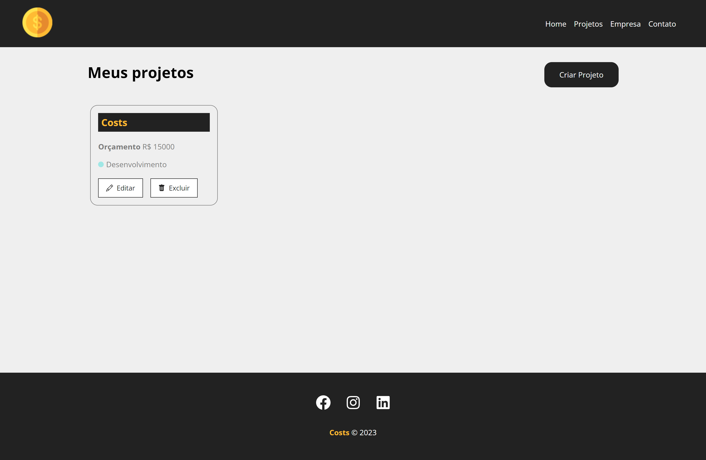
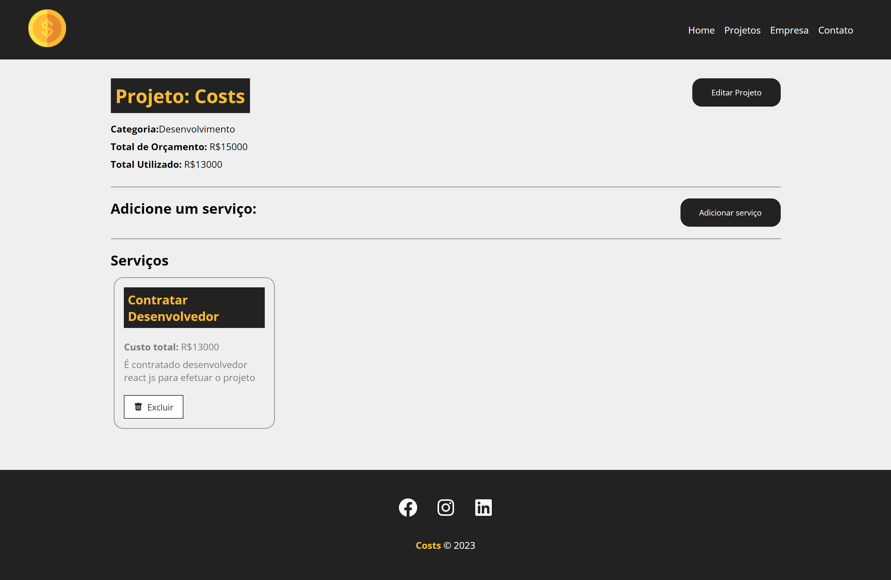

# Costs

> Costs is a site for project planning and execution, more focused on the financial part. That is, you can create several projects and see the cost of each one and the available value of it, among other features...

## Table of contents

- [Overview](#overview)
  - [The challenge](#the-challenge)
  - [Links](#links)
  - [Screenshot](#screenshot)
- [My process](#my-process)
  - [Built with](#built-with)

## Overview

### The challenge

Users should be able to:

- Create new projects
- Read all project information
- Add new services and information to the project
- Delete projects and/or services

### Links

- Live Site URL: https://costs-rafael.netlify.app

### Screenshot

  - Main
  
    
    
  - Create Project
    
     
    
  - Projects
    
     
    
  - Edit Project
    
     

## My process

### Built with

- REACT JS
- HTML
- CSS 
- JAVASCRIPT

[⬆ Back to the top](#costs) 
